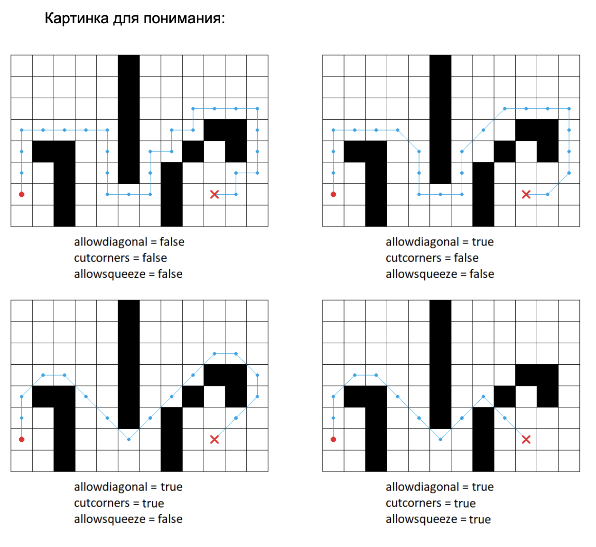
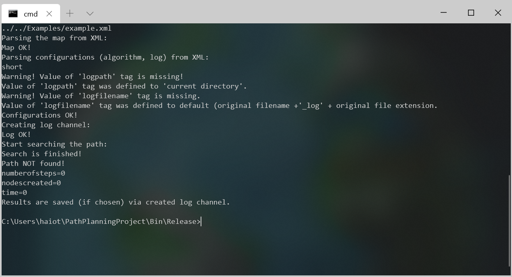

# PathPlanningProject

## Параметры входного файла

Во входном файле нужно указать следующие параметры:

* `width` и `height` &mdash; размеры карты
* `startx` и `starty` &mdash; координаты начала
* `finishx` и `finishy` &mdash; координаты конца
* `grid` &mdash; сама карта


Для смены параметров поиска пути нужно использовать следующие параметры входного файла:

* `metrictype` &mdash; может быть euclidean, manhattan, chebyshev, diagonal
* `hweight` &mdash; вес эвристики
* `allowdiagonal` &mdash; разрешено ли ходить по диагонали {true|false}. Если false, то
ходить можно только по горизонтали или вертикали
* `cutcorners` &mdash; можно ли срезать углы
* `allowsqueeze` &mdash; разрешено ли ходить по диагонали, если с обеих сторон препятствия





## Содержание выходного файла

* `numberofsteps` &mdash; число шагов алгоритма
* `nodescreated` &mdash; число вершин, созданных за время поиска 
* `length` &mdash;  длина пути в клетках
* `path` &mdash; также указывается путь с помощью звездочек
* `length_scaled` длина учитывая размер клетки
* `time` &mdash; время работы алгоритма в секундах


## Сборка проекта
Для работы над проектом требуется иметь аккаут GitHub.

Для сборки и запуска возможно использовать QMake или CMake. CMakeLists.txt и .pro файлы доступны в репозитории. Для проведения тестирования локально испольщуйте CMake. Подробные требования к ПО указаны ниже. 

### Linux
- Git 2.7.4 или выше
- CMake 3.2 или выше;
- GCC 4.9 или выше;
- Make
- QtCreator и Qt5 (по желанию).

### Mac
- Git 2.23.0 или выше
- CMake 3.2 или выше;
- Apple LLVM version 10.0.0 (clang-1000.11.45.5) или выше;
- Make
- QtCreator и Qt5 (по желанию).

### Windows
- Git 2.23.0 или выше
- CMake 3.2 или выше;
- MinGW-w64 5.0.3 или выше (должен быть добавлен в переменную среды Path);
- QtCreator и Qt5 (по желанию).

## Начало работы
Cоздайте ответвление (fork) этого репозитория в свой GitHub аккаунт. Загрузите содержимое полученного репозитория, либо клонируйте его в нужную вам директорию.
```bash
git clone https://github.com/*account*/PathPlanningProject.git
```

### Сборка и запуск

Сборку проекта возможно осуществить двумя способами:
- Используя QtCreator и qmake;
- Используя CMake.
  
При использовании QtCreator требуется открыть файл `ASearch.pro` который находится в директории `.../PathPlanningProject/Src/` и настроить проект с нужным комплектом сборки.


После выбора проекта требуется установить имя входного файла как аргумент командной строки. В качестве первого примера используйте файл `.../PathPlanningProject/Examples/example.xml`. Для установки аргументов командной строки перейдите в настройки запуска проекта и введите нужный путь к файлу в поле "Параметры командной строки".


После установки аргумента командной строки можно проверить работу программы. Следующий результат должен отобразиться в результате запуска:

```
Parsing the map from XML:
Map OK!
Parsing configurations (algorithm, log) from XML:
short
Warning! Value of 'logpath' tag is missing!
Value of 'logpath' tag was defined to 'current directory'.
Warning! Value of 'logfilename' tag is missing.
Value of 'logfilename' tag was defined to default (original filename +'_log' + original file extension.
Configurations OK!
Creating log channel:
Log OK!
Start searching the path:
Search is finished!
Path NOT found!
numberofsteps=0
nodescreated=0
time=0
Results are saved (if chosen) via created log channel.
```

При использовании CMake сборка и запуск может производиться как из командной строки, так и при помощи различных IDE (например JetBrains CLion). Ниже приведены скрипты сборки и запуска с использованием командной строки.

### Linux и Mac
Release сборка:
```bash
cd PathPlanningProject
cd Build
cd Release
cmake ../../ -DCMAKE_BUILD_TYPE="Release"
make
make install
```

Debug сборка:
```bash
cd PathPlanningProject
cd Build
cd Debug
cmake ../../ -DCMAKE_BUILD_TYPE="Debug"
make
make install
```

Запуск:
```bash
cd ../../Bin/{Debug|Release}/
./PathPlanning ../../Examples/example.xml
```
Результат запуска:


### Windows
Release сборка:
```cmd
cd PathPlanningProject
cd Build
cd Release
set PATH
cmake ../../ -DCMAKE_BUILD_TYPE="Release" -G "MinGW Makefiles"
mingw32-make
mingw32-make install
```

Debug сборка:
```cmd
cd PathPlanningProject
cd Build
cd Debug
set PATH
cmake ../../ -DCMAKE_BUILD_TYPE="Debug" -G "MinGW Makefiles"
mingw32-make
mingw32-make install
```

Запуск:
```cmd
cd ../../Bin/{Debug|Release}/
PathPlanning.exe ../../Examples/example.xml
```

Результат запуска:



## Менторы
**Яковлев Константин Сергеевич**
- kyakovlev@hse.ru
- [Сайт НИУ ВШЭ](https://www.hse.ru/staff/yakovlev-ks)
- Telegram: @KonstantinYakovlev
  
**Дергачев Степан**
- sadergachev@edu.hse.ru
- Telegram: @haiot4105


## Контакты
**Кусиденов Адильхан Маратович**
- akusidenov@edu.hse.ru
- Telegram: @kussyadil
  
